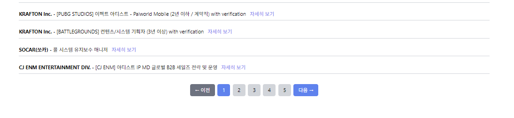

# Project 1. 채용 정보 분석 (25.04.18 ~ 25.4.24)

## 프로젝트 개요

- 프로그래머스 데이터 엔지니어링 6기 Team 2조 첫번째 프로젝트로, 각종 채용사이트에서 크롤링한 정보를 바탕으로 서울 지역 IT 채용 정보에서 자주 등장하는 키워드를 분석해, 구직자들이 채용 트렌드를 한눈에 알아보기 쉽게 파악할 수 있는 서비스 입니다.

### 프로젝트 목적

- **실시간 채용 트렌드 제공**: IT 업계에서 가장 수요가 많은 기술 및 직무 키워드를 분석
- **맞춤형 구직 지원**: 사용자가 관심 있는 분야의 채용 동향을 쉽게 파악할 수 있도록 시각화
- **데이터 기반 취업 전략 수립**: 키워드 분석을 통해 구직자들의 이력서 및 기술에 대해 최적화 지원

## 주요 기능

1. 채용 정보 크롤링
   - 사람인, 잡코리아, LinkedIn 등 주요 채용 플랫폼에서 IT 관련 채용 정보 수집
   - Selenium과 BeautifulSoup을 활용한 효율적인 데이터 추출
   - 불필요한 정보 필터링 및 정제
2. 데이터 시각화
   - 워드클라우드: 채용 공고에서 자주 언급되는 기술 키워드 시각화
   - 파이 차트: 신입/경력 채용 비율 분석
3. 맞춤형 검색: 직무별, 기술 스택별 필터링 기능

## 프로젝트 역할 분담 및 상세

| **팀원** | **담당 역할 및 구현 업무** |
| --- | --- |
| **손성배** (팀장) | 데이터 수집 (원티드), 프론트엔드 및 백엔드 기능 구현 (맞춤형 채용 공고 추천), 프로젝트 총괄 관리 |
| **양창우** | 데이터 수집 (랠릿), 프론트엔드 및 백엔드 기능 구현 (맞춤형 채용 공고 추천) |
| **김현호** | 데이터 수집 (링크드인), 프론트엔드 및 백엔드 기능 개발 (공고 목록 & 상세 페이지 구현) |
| **정동영** | 데이터 수집 (잡코리아), 데이터 시각화 개발 (키워드 분석 워드클라우드), 채용 비율 분석 (신입/경력 파이차트 시각화) |
| **서미지** | 데이터 수집 (사람인), 데이터 시각화 개발 (키워드 분석 워드클라우드), 채용 비율 분석 (신입/경력 파이차트 시각화) |

## Installation

- pip 사용 :

   ```shell
   pip install -r requirements
   ```

   _python3.9이상에선 backports.zoneinfo 제외 필요_
- poetry 사용

   ```shell
   poetry add $(cat requirements.txt)
   poetry install
   ```

## 사용 기술 및 라이브러리

- Python3.x
- Django Framework
- SQLite
- Selenium, beautifulSoup
- konlpy, nltk
- pandas, matplotlib

## 주요 페이지 설명

1. 메인 대시보드
   
   - 채용 키워드 분석: 워드클라우드와 차트를 통해 최신 채용 동향 시각화
   - 키워드 검색: 직무/기술 스택 기반 맞춤형 검색 기능
   - 채용 현황: 신입·경력 비율 등 주요 지표 한눈에 확인

2. 채용 공고 검색
   
   
   - 페이징 처리: 검색 결과 20개 단위로 페이징 처리

3. 채용 공고 리스트
   
   
   - 종합 검색: 회사명, 직무명, 기술 키워드 다중 필터링
   - 페이징 처리: 40개 단위로 편리하게 탐색

4. 채용 상세 페이지
   
   - 구조화된 정보: 모집분야, 주요업무 등 카테고리별 정리
   - 네비게이션: 이전/다음 공고 편리하게 이동
   - 원본 링크: 채용 사이트로 바로 연결
